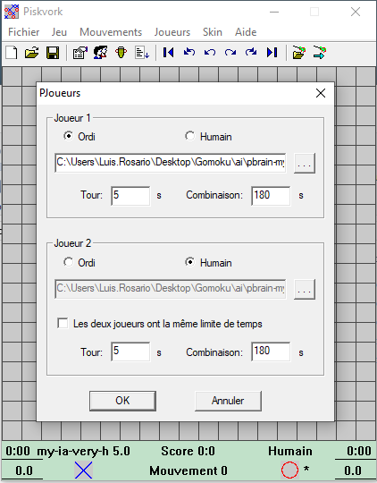
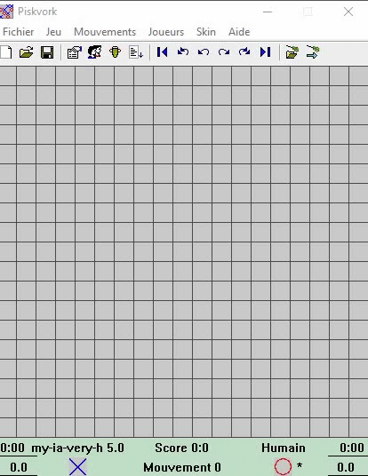

# Gomoku (A.I of gomoku)

The aim of the project is to create a gomoku algorithm.

## Goals

- Beat the opponent.

## Requirements

* Python 3.7+
* Working on windows only

## Usage

#### Run the binary

```bash
run the binary called "piskvork"
```
###### that one


#### Choose an A.I or a player

To choose if you want to play against an AI or a human go to :

    .
    ├ Joueurs
    └ Préférences...

And select the A.I in the ai folder




And click on the board to start the game

## Example



## Authors

* **Luis Rosario** - *Member 1* - [Luisrosario](https://github.com/Luisrosario2604)
